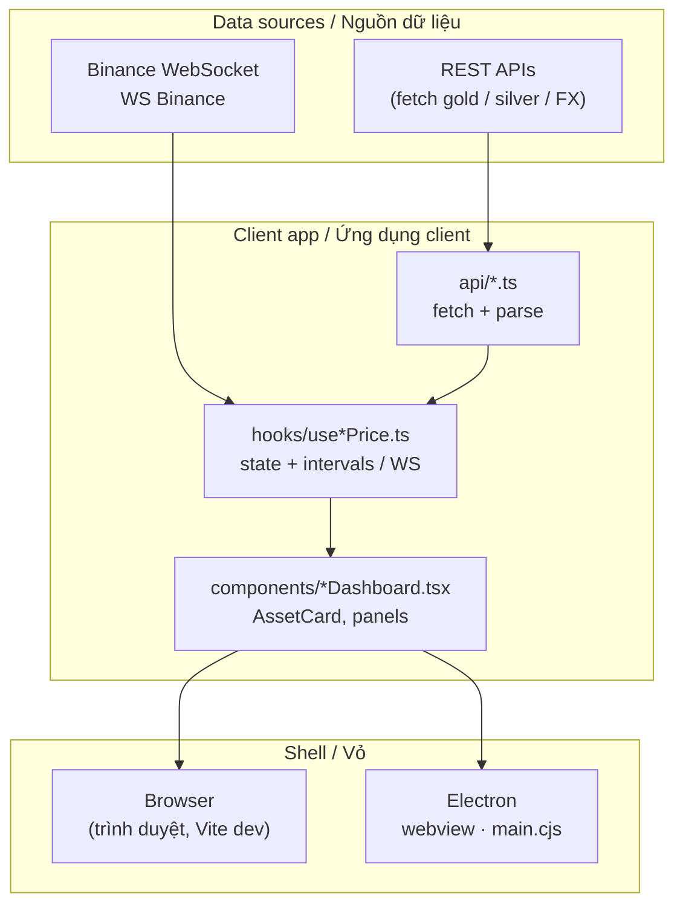
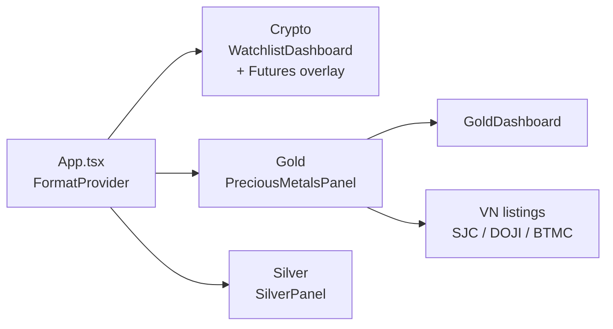
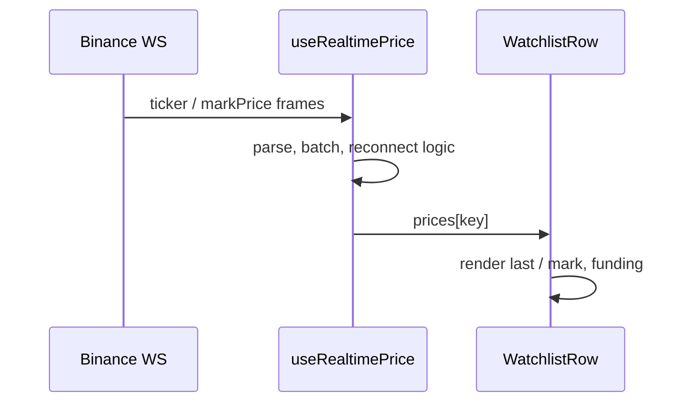
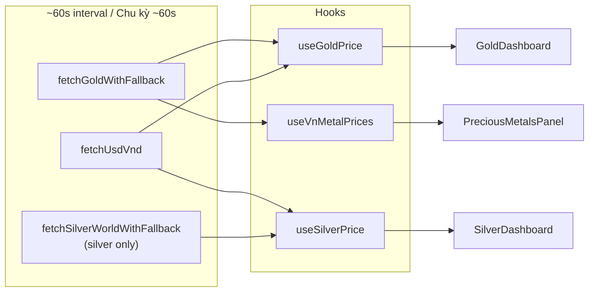
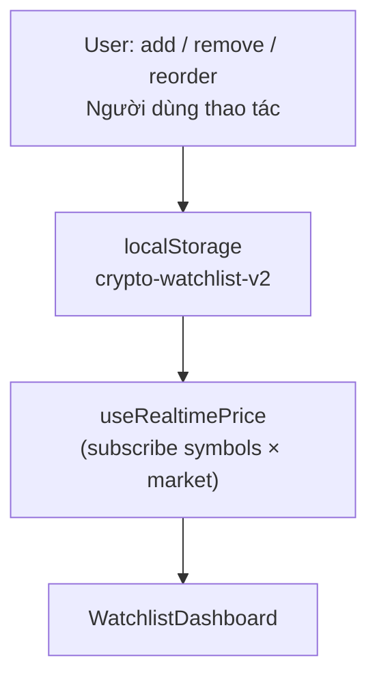
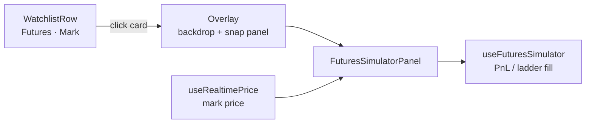

# Crypto Desktop Widget — PROJECT OVERVIEW  
*Tổng quan dự án / Project overview (English–Vietnamese)*

---

## 1. Project Overview | Tổng quan dự án

**EN — What it does**  
A compact **desktop widget** (Electron) and **web UI** (Vite) for **live crypto prices** (Binance), **gold** and **silver** (world spot converted to VND + domestic listings), with configurable number formatting (VND/USD, etc.).

**VI — Ứng dụng làm gì**  
Widget desktop (Electron) + giao diện web (Vite) theo dõi **giá crypto realtime** (Binance), **vàng** và **bạc** (spot thế giới quy đổi VND, niêm yết trong nước), có tùy chọn định dạng hiển thị (VND/USD, v.v.).

**EN — Target users**  
Individuals who want a **small always-visible price board** (light traders, gold/silver/crypto watchers) without a full exchange app.

**VI — Đối tượng**  
Người dùng cá nhân cần **bảng giá gọn trên màn hình** (trader nhẹ, người theo dõi vàng/bạc/crypto), không cần full sàn.

**EN — Problem solved**  
Aggregates **multiple price sources** (WebSocket + REST) into **one small window** (optionally always-on-top), reducing browser tabs and heavy apps.

**VI — Vấn đề giải quyết**  
Gom **nhiều nguồn giá** (WebSocket + REST) vào **một cửa sổ nhỏ**, luôn nổi (Electron), tránh mở nhiều tab hoặc app nặng.

---

## 2. Tech Stack | Công nghệ

| Layer / Lớp | EN | VI |
|---------------|----|----|
| **Frontend** | React 19, TypeScript, Vite 8, Tailwind CSS 4 | React 19, TypeScript, Vite 8, Tailwind CSS 4 |
| **Desktop** | Electron (~41) — `electron/main.cjs` | Electron (~41) — `electron/main.cjs` |
| **Backend** | *None* — public APIs & WebSockets from the client | *Không server riêng* — API công khai / WebSocket từ client |
| **Realtime** | Binance **WebSocket** (spot ticker + futures **mark price**), batching + reconnect in hooks | **WebSocket** Binance (spot + futures mark), gộp batch + reconnect trong hook |
| **Database** | *None* — crypto watchlist in **`localStorage`** (`crypto-watchlist-v2`) | *Không DB* — watchlist crypto trong **`localStorage`** |

---

## 3. Core Features | Tính năng chính

| EN | VI |
|----|-----|
| **Realtime crypto** — USDT pairs, Spot (last) / Futures (mark), per-row or global market mode, drag-and-drop sort (`@dnd-kit`). | **Crypto realtime** — cặp USDT, Spot (last) / Futures (mark), SPOT/FUT theo dòng hoặc chung, kéo thả sắp xếp. |
| **Gold valuation widget** — clean card UI focused on **VN vs world** and **spread** (premium/discount insight + optional bar). | **Vàng (widget định giá)** — thẻ tối giản tập trung **VN vs TG** và **spread** (insight + thanh so sánh). |
| **Silver valuation widget** — world XAG + VN listing when available; spread uses **VN mid vs world mid** (hook logic). | **Bạc (widget định giá)** — XAG TG + niêm yết VN khi có; spread theo **giữa VN vs giữa TG**. |
| **Domestic listings (responsive)** — long domestic lists are hidden on small widths; shown from larger breakpoints for readability. | **Niêm yết trong nước (responsive)** — danh sách dài ẩn ở màn hình nhỏ, chỉ hiện khi đủ rộng. |
| **Formatting** — `FormatProvider`, `formatPrice` / `useFormatPrice`. | **Định dạng số** — `FormatProvider` + `useFormatPrice`. |
| **UTC sessions** — Asia / EU / US bar with **minimal tooltip (3 lines)** and small delay. | **Phiên UTC** — thanh Asia / EU / US có **tooltip 3 dòng** (delay nhẹ). |
| **Futures Simulator** — floating panel from **Futures** rows: snap to right (8px gap), optional drag + edge snap (~20px), backdrop + **ESC** / outside click to close; PnL / TP / SL / R:R / liq (approx.); **price ladder** (% vs mark) fills Entry / TP / SL. | **Futures Simulator** — panel nổi từ dòng Futures: snap phải, kéo/snap cạnh, đóng ESC/click nền; thang giá điền Entry/TP/SL. |
| **Scroll UX** — `index.css`: WebKit/Firefox scrollbar overlay-style (dim until interaction). | **Thanh cuộn** — ẩn / hé hiện khi tương tác (Chromium/Electron; Firefox ẩn). |
| **Metal market utility** — `getMetalMarketStatus` (OTC-style weekend gap Fri 22:00–Sun 22:00 UTC); ready for gold/silver status UI. | **Helper phiên kim loại** — `getMetalMarketStatus` (model OTC cuối tuần UTC); sẵn cho UI Vàng/Bạc. |
| **Electron** — always-on-top, drag regions. | **Electron** — luôn trên cùng, vùng kéo cửa sổ. |
| **Interaction system (subtle)** — low-contrast row hover, pointer/brightness on prices, subtle focus rings, directional price flash (up/down), small pulse on ladder-fill target inputs. | **Hệ tương tác (tinh tế)** — hover nhẹ, giá có pointer/brightness, focus ring mờ, flash giá lên/xuống, pulse nhẹ khi click ladder điền ô mục tiêu. |

**EN — Not in repo yet:** push alerts, automated buy/sell signals, or advanced analytics (future work).  
**VI — Chưa có:** alert đẩy, tín hiệu mua/bán tự động, analytics nâng cao (có thể mở rộng sau).

**EN — Disclaimer:** Futures Simulator is a **toy model** (not exchange-grade margins / fees).  
**VI — Lưu ý:** Futures Simulator chỉ **mô phỏng**, không thay lệnh hay margin thật trên sàn.

---

## 4. Architecture | Kiến trúc

**EN — Conceptual pipeline:** external feeds → fetch/parse layer → React state → dashboard components → browser or Electron shell.  
**VI — Luồng khái niệm:** nguồn ngoài → tầng fetch/parse → state React → component dashboard → trình duyệt hoặc Electron.

### 4.1 Mermaid — High-level architecture | Kiến trúc tổng thể

### 4.2 Mermaid — App tabs & layout | Tab và bố cục

### 4.3 EN / VI — Module notes

- **Crypto:** WebSocket → `useRealtimePrice` → price map `(symbol, market)` → `WatchlistDashboard` / `WatchlistRow`; **Futures** rows open `FuturesSimulatorPanel` (overlay) with mark-driven ladder + `useFuturesSimulator`.  
  **Crypto:** WebSocket → `useRealtimePrice` → `WatchlistDashboard` / `WatchlistRow`; dòng **Futures** mở simulator nổi + hook tính PnL.

- **Gold / Silver:** `fetchGoldWithFallback`, `fetchUsdVnd`, (`fetchSilverWorldWithFallback` for silver) → `useGoldPrice` / `useSilverPrice` / `useVnMetalPrices` → dashboards.  
  **Vàng / Bạc:** `fetchGoldWithFallback`, `fetchUsdVnd`, (`fetchSilverWorldWithFallback`) → các hook tương ứng → dashboard.

---

## 5. Key Files / Modules | File và module quan trọng

| Path | EN (role) | VI (vai trò) |
|------|-----------|--------------|
| `tailwind.config.js` | Tailwind design tokens (typography/colors/radius/shadow) | Token thiết kế Tailwind (chữ/màu/radius/shadow) |
| `electron/main.cjs` | Electron window, preload, always-on-top | Cửa sổ Electron, preload, always-on-top |
| `src/App.tsx` | Tabs Crypto / Gold / Silver, format shell | Tab Crypto / Vàng / Bạc, khung format |
| `src/hooks/useRealtimePrice.ts` | Binance WS, connection state, prices | WebSocket Binance, trạng thái kết nối, giá |
| `src/hooks/useGoldPrice.ts` | Gold polling + FX, sell-vs-sell spread | Polling vàng + FX, spread bán VN vs TG |
| `src/hooks/useSilverPrice.ts` | Silver world + VN listing, mid spread | Bạc TG + niêm yết VN, spread giữa |
| `src/hooks/useVnMetalPrices.ts` | Domestic gold table (many codes) | Bảng vàng nội địa (nhiều mã) |
| `src/api/fetch*.ts` | HTTP clients + fallbacks / cache | Client HTTP + fallback / cache |
| `src/components/*Dashboard*.tsx` | Tab UIs | Giao diện từng tab |
| `src/components/WatchlistDashboard.tsx` | Crypto watchlist, DnD, futures overlay shell | Watchlist + overlay simulator |
| `src/components/AssetCard.tsx` | Shared card layout | Layout thẻ dùng chung |
| `src/components/FuturesSimulatorPanel.tsx` | Floating futures PnL UI + price ladder | Panel simulator + thang giá |
| `src/components/ValuationWidget.tsx` | Shared valuation-focused card (gold/silver) | Thẻ định giá dùng chung (vàng/bạc) |
| `src/hooks/useFuturesSimulator.ts` | Entry/leverage/size/TP/SL state + PnL math | State + công thức PnL |
| `src/utils/futuresPriceLadder.ts` | Adaptive tick ladder around mark | Bậc giá quanh mark |
| `src/utils/metalMarketStatus.ts` | OTC-style open / closed / opening-soon (weekend UTC) | Trạng thái phiên spot kim loại (helper) |
| `src/utils/tradingSession.ts` | Crypto UTC session bands (Asia/EU/US) | Phiên crypto theo giờ UTC |
| `src/index.css` | Tailwind import + theme vars, drag regions, scrollbar overlay, shared interaction utilities | CSS global + theme, scrollbar, utility tương tác |
| `src/providers/FormatProvider.tsx` | Display format context | Context định dạng hiển thị |

---

## 6. Data Flow | Luồng dữ liệu

### 6.1 Mermaid — Crypto (WebSocket)

**EN:** `stream.binance.com` / `fstream.binance.com` → parse → batched `prices` state → row UI (basis spot–fut when both exist).  
**VI:** Combined streams → parse → state `prices` theo batch → UI dòng (basis spot–fut khi đủ dữ liệu).

### 6.2 Mermaid — Gold & silver (polling)

**EN:** REST snapshots + FX rate → spread helpers (`metalSpot`, `goldPrice`) → formatted UI.  
**VI:** Snapshot REST + tỷ giá → helper spread → UI đã format.

### 6.3 Mermaid — Watchlist persistence | Watchlist lưu local

### 6.4 Mermaid — Futures Simulator overlay | Simulator nổi

**EN:** Click on a **Futures** row opens the overlay; panel consumes **futures mark** for live mark + ladder centering; user chooses Entry / TP / SL target then clicks ladder rungs.  
**VI:** Chạm dòng **Futures** mở overlay; panel dùng **giá mark** cho mark realtime và thang giá; chọn ô Entry/TP/SL rồi click mức giá.

---

## 7. Known Issues / Constraints | Hạn chế đã biết

| EN | VI |
|----|-----|
| Gold/silver update on **polling (~60s)**, not per-second like crypto WS. | Vàng/bạc cập nhật theo **polling (~60s)**, không mượt từng giây như crypto WS. |
| Depends on **external APIs**; outages / rate limits → warnings, **cache** or **mock** (e.g. VN gold without SJC). | Phụ thuộc **API ngoài**; lỗi mạng / rate limit → cảnh báo, **cache** hoặc **mock** (vàng VN thiếu SJC). |
| WebSocket **reconnect** cycles may cause brief gaps; status shown in UI. | **Reconnect** WS có thể tạo khoảng trống ngắn; UI hiển thị trạng thái. |
| **No server DB** — clearing storage or new device loses watchlist unless export is added later. | **Không DB** — xóa storage hoặc đổi máy mất watchlist (trừ khi sau này có export). |
| **VN silver** depends on listing feed containing a silver row. | **Bạc VN** phụ thuộc bảng niêm yết có dòng bạc. |
| **Futures Simulator** uses simplified formulas / liq approximation; not a substitute for exchange risk tools. | **Simulator** dùng công thức đơn giản; không thay công cụ quản trị rủi ro trên sàn. |
| **`getMetalMarketStatus`** models generic OTC metal hours; broker feeds may differ. | **`getMetalMarketStatus`** là model OTC tổng quát; giờ thật có thể khác từng broker. |

---

## Related docs | Tài liệu liên quan

- **Run & intro / Chạy & giới thiệu repo:** [README.md](./README.md)
