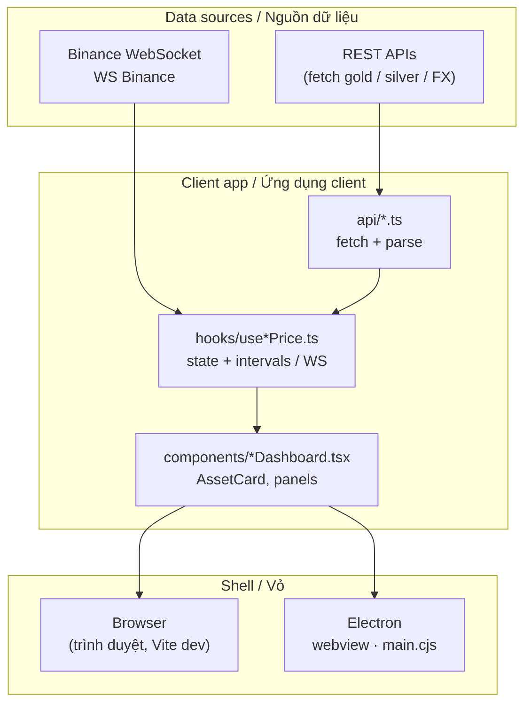
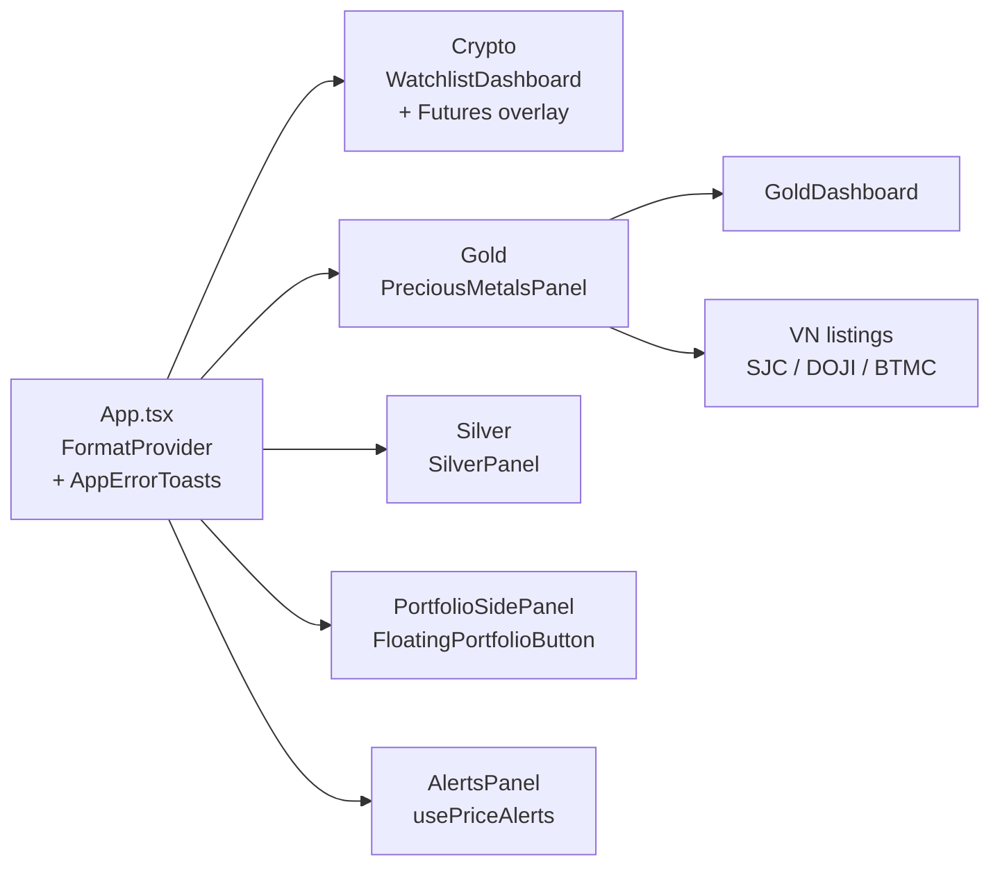
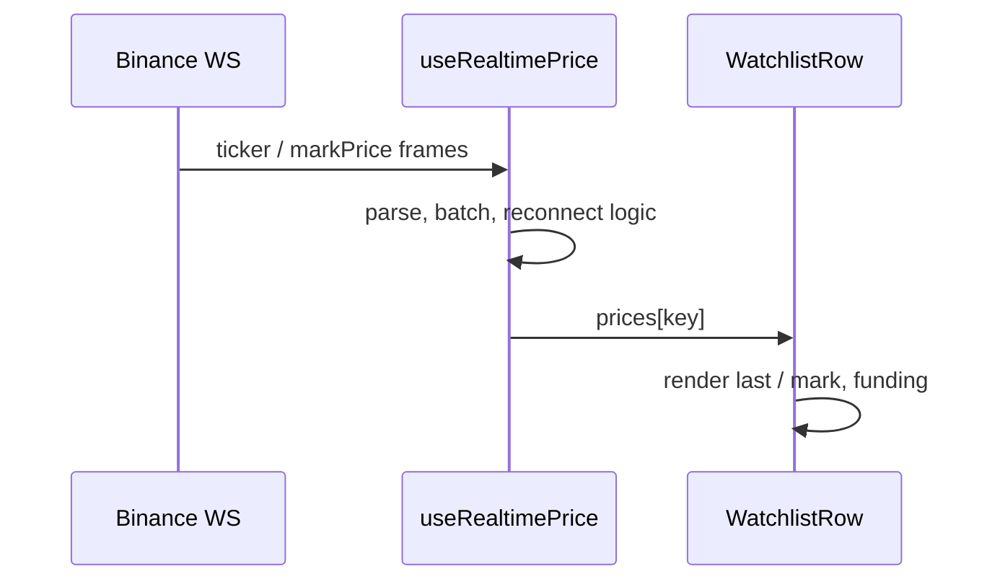
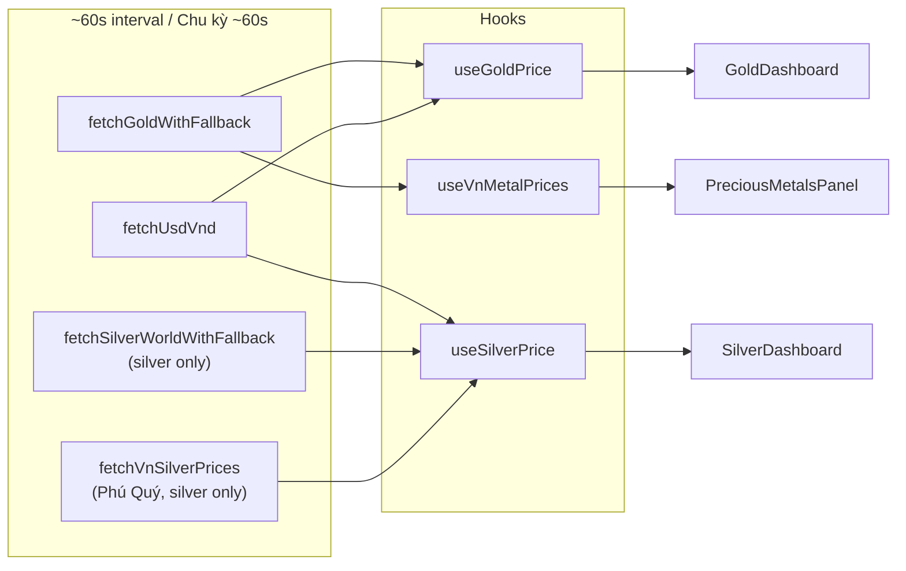
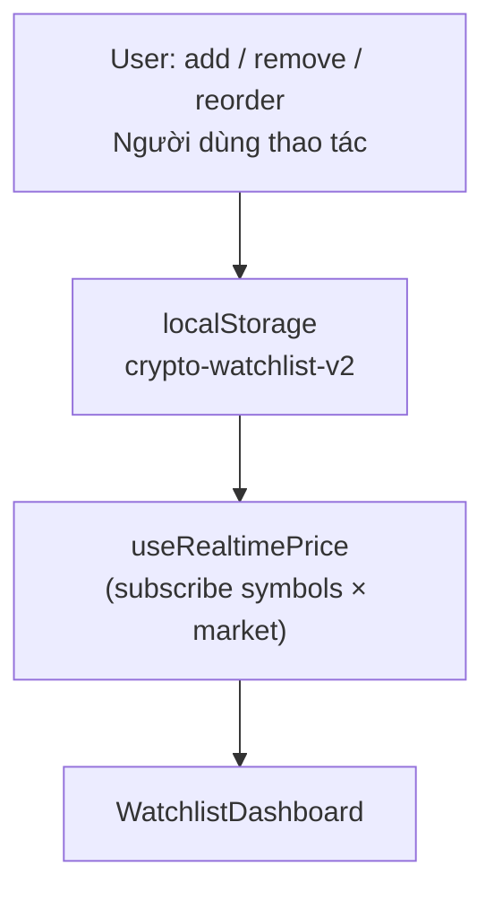
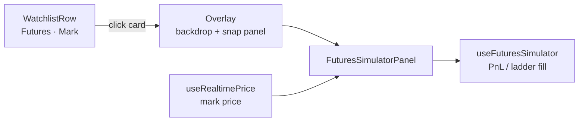
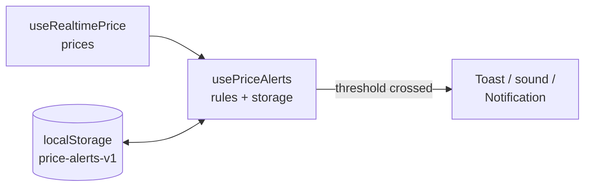

# Crypto Desktop Widget — PROJECT OVERVIEW  
*Tổng quan dự án / Project overview (English–Vietnamese)*

---

## 1. Project Overview | Tổng quan dự án

**EN — What it does**  
A compact **desktop widget** (Electron) and **web UI** (Vite) for **live crypto prices** (Binance), **gold** and **silver** (world spot converted to VND + domestic listings), with configurable number formatting (VND/USD, etc.).

**VI — Ứng dụng làm gì**  
Widget desktop (Electron) + giao diện web (Vite) theo dõi **giá crypto realtime** (Binance), **vàng** và **bạc** (spot thế giới quy đổi VND, niêm yết trong nước), có tùy chọn định dạng hiển thị (VND/USD, v.v.).

**EN — Target users**  
Individuals who want a **small always-visible price board** (light traders, gold/silver/crypto watchers) without a full exchange app.

**VI — Đối tượng**  
Người dùng cá nhân cần **bảng giá gọn trên màn hình** (trader nhẹ, người theo dõi vàng/bạc/crypto), không cần full sàn.

**EN — Problem solved**  
Aggregates **multiple price sources** (WebSocket + REST) into **one small window** (optionally always-on-top), reducing browser tabs and heavy apps.

**VI — Vấn đề giải quyết**  
Gom **nhiều nguồn giá** (WebSocket + REST) vào **một cửa sổ nhỏ**, luôn nổi (Electron), tránh mở nhiều tab hoặc app nặng.

---

## 2. Tech Stack | Công nghệ

| Layer / Lớp | EN | VI |
|---------------|----|----|
| **Frontend** | React 19, TypeScript, Vite 8, Tailwind CSS 4 | React 19, TypeScript, Vite 8, Tailwind CSS 4 |
| **Desktop** | Electron (~41) — `electron/main.cjs` | Electron (~41) — `electron/main.cjs` |
| **Backend** | *None* — public APIs & WebSockets from the client | *Không server riêng* — API công khai / WebSocket từ client |
| **Realtime** | Binance **WebSocket** (spot ticker + futures **mark price**), batching + reconnect + user **retry** in hook; **ConnectionBanner** when disconnected/reconnecting | **WebSocket** Binance, batch + reconnect + **Thử lại** trong hook; banner khi mất kết nối |
| **Database** | *None* — persistent keys: **`crypto-watchlist-v2`**, **`futures-portfolio-v1`**, **`futures-simulator-state-v1`**, **`price-alerts-v1`**, **`price-alerts-settings-v1`**, **`binance-api-credentials`** / **`binance-api-base-url`** (optional); caches for metals | *Không DB* — các key trên trong **`localStorage`** (+ cache kim loại tuỳ API) |
| **Portfolio sync** | Binance Futures REST (HMAC SHA256 signed via WebCrypto), read-only | Đồng bộ Portfolio qua REST Binance Futures (ký HMAC SHA256 bằng WebCrypto), chỉ đọc |

---

## 3. Core Features | Tính năng chính

| EN | VI |
|----|-----|
| **Realtime crypto** — USDT pairs, Spot (last) / Futures (mark), per-row or global market mode, drag-and-drop sort (`@dnd-kit`). | **Crypto realtime** — cặp USDT, Spot (last) / Futures (mark), SPOT/FUT theo dòng hoặc chung, kéo thả sắp xếp. |
| **Gold valuation widget** — clean card UI focused on **VN vs world** and **spread** (premium/discount insight + optional bar). | **Vàng (widget định giá)** — thẻ tối giản tập trung **VN vs TG** và **spread** (insight + thanh so sánh). |
| **Silver valuation widget** — world XAG + VN listings (**Phú Quý**) when available; spread uses **VN mid vs world mid** (hook logic); detail section shows per-product listing cards. | **Bạc (widget định giá)** — XAG TG + niêm yết VN (**Phú Quý**) khi có; spread giữa VN vs giữa TG; chi tiết từng sản phẩm. |
| **Domestic listings (responsive)** — long domestic lists are hidden on small widths; shown from larger breakpoints for readability. | **Niêm yết trong nước (responsive)** — danh sách dài ẩn ở màn hình nhỏ, chỉ hiện khi đủ rộng. |
| **Formatting** — `FormatProvider`, `formatPrice` / `useFormatPrice`. | **Định dạng số** — `FormatProvider` + `useFormatPrice`. |
| **UTC sessions** — Asia / EU / US bar with **minimal tooltip (3 lines)** and small delay. | **Phiên UTC** — thanh Asia / EU / US có **tooltip 3 dòng** (delay nhẹ). |
| **Futures Simulator** — floating panel from **Futures** rows: snap to right (8px gap), optional drag + edge snap (~20px), backdrop + **ESC** / outside click to close; PnL / TP / SL / R:R / liq (approx.); **price ladder** (% vs mark) fills Entry / TP / SL. | **Futures Simulator** — panel nổi từ dòng Futures: snap phải, kéo/snap cạnh, đóng ESC/click nền; thang giá điền Entry/TP/SL. |
| **Portfolio (manual + synced)** — manual futures positions (optional **note** field) + optional **Binance Futures API sync** (read-only). Synced positions are read-only; auto refresh ~60s while panel is open; supports mainnet/testnet. **Side panel** from floating button + shortcut. | **Portfolio** — vị thế nhập tay (có **ghi chú** tùy chọn) + đồng bộ Binance (chỉ đọc). Panel cạnh + nút nổi + phím tắt. |
| **Price alerts (crypto)** — above/below targets per symbol + market (spot/futures); **local persistence**; in-app toast + optional sound + **Notification** API (permission-gated); quick-add from row bell; **AlertsPanel** + header badge. | **Cảnh báo giá** — Above/Below theo symbol + thị trường; lưu local; toast + âm + desktop notify (nếu được quyền); thêm nhanh từ chuông dòng. |
| **Keyboard shortcuts** — `useKeyboardShortcuts` + **ShortcutsHelpModal** (`?`): tab switch, Portfolio, Alerts, search focus, refresh, Escape to close overlays. | **Phím tắt** — hook + modal `?`: đổi tab, Portfolio, Alerts, focus tìm kiếm, làm mới, Esc. |
| **Loading / error UX** — **Skeleton** rows (watchlist, metals, portfolio) during hydrate/fetch; **ErrorState** / **ErrorIndicator** + **fetchWithRetry** for REST; **friendlyErrors** / **binanceErrorToVi** (Vietnamese); **AppErrorToasts** for sync/storage quota issues. | **UX tải & lỗi** — skeleton; thông báo lỗi + retry; copy tiếng Việt; toast lỗi (sync, storage). |
| **Crypto watchlist chrome** — dark **Binance/Bybit-style** toolbar, column header, **ConnectionBanner**, **ConnectionStatusDot** (green/amber/red), **status bar** (prices / latency / funding when on Futures tab). | **Giao diện watchlist** — dark kiểu sàn, header cột, banner kết nối, chấm trạng thái, status bar. |
| **Sparkline (crypto rows)** — SVG mini chart per symbol (Klines REST via `useSparklineData`); green up / red down / slate flat. | **Sparkline (dòng crypto)** — biểu đồ mini SVG từ Klines REST; xanh lên / đỏ xuống. |
| **Price movement strip (metals)** — short-history mini sparkline + absolute/% change + **VolatilityBadge** (Low/Med/High) on gold/silver cards; uses `usePriceMovement` + `priceMovementMath`. | **Dải biến động giá (kim loại)** — sparkline ngắn hạn + % + badge biến động; dùng `usePriceMovement`. |
| **Stale / offline banner (metals)** — `StaleBanner` warns when browser is offline or displaying cached data, shows cache timestamp + manual refresh button; driven by `useOnlineStatus`. | **Banner stale/offline (kim loại)** — cảnh báo ngoại tuyến hoặc dữ liệu cache; nút Làm mới. |
| **Funding rate** — current rate + next funding time in watchlist status bar (Futures); per-position **funding PnL** in Portfolio via `fundingCalculator`. | **Funding rate** — rate + thời gian kế tiếp trên status bar; PnL funding theo vị thế trong Portfolio. |
| **Alert trigger toast** — dedicated floating toast stack (`AlertToast`) for fired price alerts (auto-dismiss ~9s), separate from error toasts. | **Toast cảnh báo** — toast nổi riêng cho alert kích hoạt (tự đóng ~9s). |
| **Scroll UX** — `index.css`: WebKit/Firefox scrollbar overlay-style (dim until interaction). | **Thanh cuộn** — ẩn / hé hiện khi tương tác (Chromium/Electron; Firefox ẩn). |
| **Metal market utility** — `getMetalMarketStatus` (OTC-style weekend gap Fri 22:00–Sun 22:00 UTC); ready for gold/silver status UI. | **Helper phiên kim loại** — `getMetalMarketStatus` (model OTC cuối tuần UTC); sẵn cho UI Vàng/Bạc. |
| **Electron** — always-on-top, drag regions; **version label** shown near window controls, read from `package.json` at build time via Vite `define`. | **Electron** — luôn trên cùng, vùng kéo cửa sổ; **nhãn version** nhỏ cạnh nút điều khiển, đọc từ `package.json` lúc build. |
| **macOS distribution (.dmg)** — `electron-builder` (`npm run dist:mac`): Vite build → asar bundle → DMG in `release/`; unsigned (Gatekeeper: right-click → Open on first launch). | **Đóng gói macOS (.dmg)** — `electron-builder` (`npm run dist:mac`): build Vite → bundle asar → DMG trong `release/`; không ký số (Gatekeeper: chuột phải → Open lần đầu). |
| **Interaction system (subtle)** — low-contrast row hover, pointer/brightness on prices, subtle focus rings, directional price flash (up/down), small pulse on ladder-fill target inputs. | **Hệ tương tác (tinh tế)** — hover nhẹ, giá có pointer/brightness, focus ring mờ, flash giá lên/xuống, pulse nhẹ khi click ladder điền ô mục tiêu. |

**EN — Not in scope yet:** server-side or mobile **push** delivery, automated trading signals, or advanced portfolio analytics (possible future work).  
**VI — Chưa trong scope:** **push** qua server/mobile, tín hiệu giao dịch tự động, analytics nâng cao (có thể mở rộng sau).

**EN — Disclaimer:** Futures Simulator is a **toy model** (not exchange-grade margins / fees).  
**VI — Lưu ý:** Futures Simulator chỉ **mô phỏng**, không thay lệnh hay margin thật trên sàn.

**EN — Security note (Binance keys):** Keys are stored locally and obfuscated/encrypted (AES-GCM via WebCrypto). This is **not** a guarantee of strong secrecy in a client-only app; treat keys as sensitive. Use READ-ONLY permissions only.  
**VI — Bảo mật (Binance keys):** Keys lưu cục bộ và được obfuscate/mã hoá (AES-GCM WebCrypto). Đây **không** phải bảo mật tuyệt đối trong app client-only; hãy xem keys là dữ liệu nhạy cảm. Chỉ dùng READ-ONLY.

---

## 4. Architecture | Kiến trúc

**EN — Conceptual pipeline:** external feeds → fetch/parse layer → React state → dashboard components → browser or Electron shell.  
**VI — Luồng khái niệm:** nguồn ngoài → tầng fetch/parse → state React → component dashboard → trình duyệt hoặc Electron.

### 4.1 Mermaid — High-level architecture | Kiến trúc tổng thể

### 4.2 Mermaid — App tabs & layout | Tab và bố cục

### 4.3 EN / VI — Module notes

- **Crypto:** WebSocket → `useRealtimePrice` (connecting/reconnecting + `retryConnection`) → price map `(symbol, market)` → `WatchlistDashboard` / `WatchlistRow`; sparklines via `useSparklineData` (loading/errors per row + `retry`); funding rates via `useFundingData` when needed; **ConnectionBanner** + skeleton while connecting/hydrating; **Futures** rows open `FuturesSimulatorPanel` + `useFuturesSimulator` (persisted per symbol). **`usePriceAlerts`** consumes live prices for trigger evaluation.  
  **Crypto:** WS → `useRealtimePrice` (retry) → watchlist; sparkline/funding có loading và retry; banner kết nối + skeleton; simulator + `usePriceAlerts`.

- **Portfolio:** manual positions persisted in `localStorage` (`futures-portfolio-v1`); optional Binance sync uses signed REST `GET /fapi/v2/positionRisk` and **binanceErrorToVi** / toasts on failure. Mark price for PnL uses the same futures mark WebSocket as the simulator. **`usePortfolio`** hydrates async (skeleton until `storageHydrated`).  
  **Portfolio:** lưu local; sync Binance + thông báo lỗi thân thiện; PnL theo WS mark; skeleton khi đang hydrate storage.

- **Gold / Silver:** `fetchGoldWithFallback`, `fetchUsdVnd`, (`fetchSilverWorldWithFallback` for silver) → `useGoldPrice` / `useSilverPrice` / `useVnMetalPrices` → dashboards. Silver fetches `fetchVnSilverPrices` (Phú Quý) in the same `Promise.all` as world spot + FX; VN listings shown in `SilverDashboard`. `StaleBanner` (driven by `useOnlineStatus`) warns when data is from cache or browser is offline. `PriceMovementStrip` (`usePriceMovement` + `priceMovementMath`) shows short-term sparkline + % change + volatility badge on each metal card. REST errors use `fetchResilience` (backoff) + `fetchErrors` (classify).  
  **Vàng / Bạc:** fetch → hook → dashboard. Bạc: `fetchVnSilverPrices` (Phú Quý) song song với spot TG + FX trong `Promise.all`; niêm yết VN hiện trong `SilverDashboard`. `StaleBanner` cảnh báo khi offline/cache. `PriceMovementStrip` hiện sparkline ngắn hạn + % + badge biến động. Lỗi REST dùng retry backoff + phân loại lỗi.

---

## 5. Key Files / Modules | File và module quan trọng

| Path | EN (role) | VI (vai trò) |
|------|-----------|--------------|
| `tailwind.config.js` | Tailwind design tokens (typography/colors/radius/shadow) | Token thiết kế Tailwind (chữ/màu/radius/shadow) |
| `electron/main.cjs` | Electron window, preload, always-on-top; production renderer loaded via `app.getAppPath()` (asar-safe) | Cửa sổ Electron, preload, always-on-top; renderer production dùng `app.getAppPath()` (an toàn với asar) |
| `src/App.tsx` | Tabs Crypto / Gold / Silver, format shell | Tab Crypto / Vàng / Bạc, khung format |
| `src/hooks/useRealtimePrice.ts` | Binance WS, connection state, prices | WebSocket Binance, trạng thái kết nối, giá |
| `src/hooks/useGoldPrice.ts` | Gold polling + FX, sell-vs-sell spread | Polling vàng + FX, spread bán VN vs TG |
| `src/hooks/useSilverPrice.ts` | Silver world + VN listing, mid spread | Bạc TG + niêm yết VN, spread giữa |
| `src/hooks/useVnMetalPrices.ts` | Domestic gold table (many codes) | Bảng vàng nội địa (nhiều mã) |
| `src/api/fetch*.ts` | HTTP clients + fallbacks / cache | Client HTTP + fallback / cache |
| `src/components/*Dashboard*.tsx` | Tab UIs | Giao diện từng tab |
| `src/components/WatchlistDashboard.tsx` | Crypto watchlist, DnD, futures overlay shell | Watchlist + overlay simulator |
| `src/components/AssetCard.tsx` | Shared card layout | Layout thẻ dùng chung |
| `src/components/FuturesSimulatorPanel.tsx` | Floating futures PnL UI + price ladder | Panel simulator + thang giá |
| `src/components/ValuationWidget.tsx` | Shared valuation-focused card (gold/silver) | Thẻ định giá dùng chung (vàng/bạc) |
| `src/hooks/useFuturesSimulator.ts` | Entry/leverage/size/TP/SL state + PnL math | State + công thức PnL |
| `src/components/PortfolioDashboard.tsx` | Portfolio UI (manual + synced sections) | UI Portfolio (manual + synced) |
| `src/components/PositionRow.tsx` | One position row (Binance-style fields) | Dòng vị thế (terminology kiểu Binance) |
| `src/components/ApiKeySettings.tsx` | Binance API key management UI (read-only) | UI quản lý API key Binance (chỉ đọc) |
| `src/hooks/usePortfolio.ts` | Manual portfolio state + realtime mark PnL | State portfolio + PnL theo mark |
| `src/hooks/useBinanceSync.ts` | Read-only Binance sync + auto refresh | Đồng bộ Binance chỉ đọc + auto refresh |
| `src/api/binanceAccount.ts` | Signed REST calls to Binance Futures | REST ký HMAC tới Binance Futures |
| `src/utils/encryption.ts` | Local obfuscation/encryption helpers for stored keys | Helper mã hoá/obfuscate keys lưu local |
| `src/utils/futuresPriceLadder.ts` | Adaptive tick ladder around mark | Bậc giá quanh mark |
| `src/utils/metalMarketStatus.ts` | OTC-style open / closed / opening-soon (weekend UTC) | Trạng thái phiên spot kim loại (helper) |
| `src/utils/tradingSession.ts` | Crypto UTC session bands (Asia/EU/US) | Phiên crypto theo giờ UTC |
| `src/index.css` | Tailwind import + theme vars, drag regions, scrollbar overlay, shared interaction utilities | CSS global + theme, scrollbar, utility tương tác |
| `src/providers/FormatProvider.tsx` | Display format context | Context định dạng hiển thị |
| `src/hooks/useKeyboardShortcuts.ts` | Global shortcuts; dispatches tab/portfolio/alerts/refresh events | Phím tắt toàn cục |
| `src/components/ShortcutsHelpModal.tsx` | Shortcut reference (`?`) | Modal trợ giúp phím tắt |
| `src/hooks/usePriceAlerts.ts` | Alert CRUD, settings, trigger (toast/sound/Notification), storage hydration | Hook cảnh báo giá + lưu local |
| `src/types/alerts.ts` | `PriceAlert`, conditions, settings types | Kiểu TypeScript cho alerts |
| `src/components/AlertsPanel.tsx` / `AddAlertForm.tsx` | Alerts management UI | UI panel + form thêm alert |
| `src/components/Skeleton.tsx`, `WatchlistSkeleton.tsx`, `PortfolioSkeleton.tsx`, `CardSkeleton.tsx` | Shimmer placeholders while loading | Skeleton / shimmer |
| `src/components/ConnectionBanner.tsx` | WS disconnect / reconnect / retry affordance | Banner kết nối |
| `src/components/ErrorState.tsx` / `ErrorIndicator.tsx` | Inline friendly errors + retry | Trạng thái lỗi + retry |
| `src/components/AppErrorToasts.tsx` | Stacked error toasts (e.g. Binance sync, quota) | Toast lỗi stack |
| `src/utils/appToast.ts` | `showErrorToast` helper | Helper hiện toast lỗi |
| `src/utils/friendlyErrors.ts` / `binanceErrorToVi` | User-facing VN copy for HTTP/API errors | Lỗi thân thiện tiếng Việt |
| `src/utils/fetchWithRetry.ts` | Bounded retries for REST fetches | Fetch có retry |
| `src/hooks/useSparklineData.ts` | Mini chart series: `isLoading`, `errorsByKey`, `retry` | Sparkline + lỗi từng dòng |
| `src/hooks/useFundingData.ts` | Per-symbol funding: loading/error/retry | Funding rate REST |
| `src/components/FloatingPortfolioButton.tsx` / `PortfolioSidePanel.tsx` | Portfolio entry + slide-over shell | Nút + panel Portfolio |
| `src/utils/exportImport.ts` | Backup/restore watchlist, portfolio, alerts, simulator | Export/import JSON |
| `src/components/ImportConfirmDialog.tsx` / `BackupImportFlash.tsx` / `PortfolioSettingsMenu.tsx` | Import confirm + post-import flash + settings menu (⚙) | Dialog xác nhận import + flash + menu cài đặt |
| `src/components/Sparkline.tsx` | SVG sparkline (auto-scale, colour by direction) | Biểu đồ sparkline SVG |
| `src/components/priceMovement/*` | `PriceMovementStrip`, `MiniSparkline`, `PriceChangeDisplay`, `VolatilityBadge` | Dải biến động (metals) |
| `src/hooks/usePriceMovement.ts` | Short-history sampling, trend, volatility level | Lấy mẫu giá ngắn hạn, xu hướng, biến động |
| `src/utils/priceMovementMath.ts` | Trend detection, coefficient of variation, volatility buckets | Toán trend + biến động |
| `src/components/StaleBanner.tsx` | Offline / stale-data warning banner (metals) | Banner stale/offline |
| `src/hooks/useOnlineStatus.ts` | Browser `navigator.onLine` reactive hook | Hook online/offline trình duyệt |
| `src/components/AlertToast.tsx` | Floating toast stack for fired price alerts | Toast cảnh báo giá |
| `src/components/ConnectionStatusDot.tsx` | Green/amber/red WS health dot in header | Chấm trạng thái kết nối |
| `src/components/SessionBar.tsx` | UTC session bar (Asia/EU/US) | Thanh phiên giao dịch UTC |
| `src/components/FormatControls.tsx` | Currency/mode segmented toggle | Nút chuyển đổi đơn vị/chế độ |
| `src/components/AddPositionForm.tsx` | Manual position entry form (Portfolio) | Form thêm vị thế thủ công |
| `src/api/fundingRate.ts` | Binance `premiumIndex` + `fundingRate` REST client | Client REST funding rate |
| `src/utils/fundingCalculator.ts` | Per-position funding PnL from history + current rate | Tính PnL funding theo vị thế |
| `src/utils/fetchResilience.ts` | Backoff schedule + `fetchWithBackoff` for stale retries | Retry backoff cho stale fetch |
| `src/utils/fetchErrors.ts` | `classifyFetchError` — categorise timeout/rate-limit/network/parse | Phân loại lỗi fetch |
| `src/utils/goldPrice.ts` / `metalSpot.ts` / `goldDisplay.ts` | Spot conversion (XAU/XAG → VND/lượng), spread helpers | Quy đổi spot + spread |
| `src/utils/cryptoPair.ts` | Normalize Binance pair input (e.g. `btc` → `btcusdt`) | Chuẩn hoá cặp Binance |
| `src/utils/vnSilverFromPrices.ts` | Extract silver row from VN listing feed | Tách dòng bạc từ bảng niêm yết VN |
| `src/utils/formatNumber.ts` / `formatPnl.ts` / `formatVndSmart.ts` | Number/PnL/VND display helpers | Helper hiển thị số/PnL/VND |
| `src/types/portfolio.ts` / `types/funding.ts` | TypeScript types for positions + funding | Kiểu TS cho vị thế + funding |
| `src/constants/vnGoldLabels.ts` | VN gold brand display labels | Nhãn hiệu vàng VN |

---

## 6. Data Flow | Luồng dữ liệu

### 6.1 Mermaid — Crypto (WebSocket)

**EN:** `stream.binance.com` / `fstream.binance.com` → parse → batched `prices` state → row UI (basis spot–fut when both exist).  
**VI:** Combined streams → parse → state `prices` theo batch → UI dòng (basis spot–fut khi đủ dữ liệu).

### 6.2 Mermaid — Gold & silver (polling)

**EN:** REST snapshots + FX rate → spread helpers (`metalSpot`, `goldPrice`) → formatted UI.  
**VI:** Snapshot REST + tỷ giá → helper spread → UI đã format.

### 6.3 Mermaid — Watchlist persistence | Watchlist lưu local

### 6.4 Mermaid — Futures Simulator overlay | Simulator nổi

**EN:** Click on a **Futures** row opens the overlay; panel consumes **futures mark** for live mark + ladder centering; user chooses Entry / TP / SL target then clicks ladder rungs.  
**VI:** Chạm dòng **Futures** mở overlay; panel dùng **giá mark** cho mark realtime và thang giá; chọn ô Entry/TP/SL rồi click mức giá.

### 6.5 Mermaid — Price alerts (client-only) | Cảnh báo giá

**EN:** Alerts compare live **spot last** or **futures mark** to stored thresholds; firing is **edge-triggered** (one shot until price moves back across). Settings (sound, desktop notify) live in **`price-alerts-settings-v1`**.  
**VI:** So sánh giá realtime với ngưỡng đã lưu; kích hoạt theo cạnh (một lần cho đến khi giá quay lại qua ngưỡng). Cài đặt âm / notify trong **`price-alerts-settings-v1`**.

---

## 7. Known Issues / Constraints | Hạn chế đã biết

| EN | VI |
|----|-----|
| Gold/silver update on **polling (~60s)**, not per-second like crypto WS. | Vàng/bạc cập nhật theo **polling (~60s)**, không mượt từng giây như crypto WS. |
| Depends on **external APIs**; outages / rate limits → warnings, **cache** or **mock** (e.g. VN gold without SJC). | Phụ thuộc **API ngoài**; lỗi mạng / rate limit → cảnh báo, **cache** hoặc **mock** (vàng VN thiếu SJC). |
| WebSocket **reconnect** cycles may cause brief gaps; status shown in UI. | **Reconnect** WS có thể tạo khoảng trống ngắn; UI hiển thị trạng thái. |
| **No server DB** — clearing storage or new device loses local data; use **export/import** (`exportImport.ts`) to back up watchlist, portfolio, alerts, simulator state. | **Không DB** — mất dữ liệu nếu xóa storage; dùng **export/import JSON** để sao lưu. |
| **Browser storage quota** — large watchlists + history can approach **`localStorage` limits**; app surfaces a toast on save failure. | **Quota storage** — watchlist lớn có thể đầy bộ nhớ; lưu lỗi hiện toast. |
| **VN silver** — one domestic source (Phú Quý, `giabac.phuquygroup.vn`); if fetch/parse fails the VN listing section is hidden while world spot remains visible. | **Bạc VN** — một nguồn nội địa (Phú Quý); nếu fetch/parse thất bại thì ẩn niêm yết VN, vẫn hiện spot TG. |
| **Futures Simulator** uses simplified formulas / liq approximation; not a substitute for exchange risk tools. | **Simulator** dùng công thức đơn giản; không thay công cụ quản trị rủi ro trên sàn. |
| **`getMetalMarketStatus`** models generic OTC metal hours; broker feeds may differ. | **`getMetalMarketStatus`** là model OTC tổng quát; giờ thật có thể khác từng broker. |

---

## Related docs | Tài liệu liên quan

- **Run & intro / Chạy & giới thiệu repo:** [README.md](./README.md)

---

*Version 1.7.1 — 2026-06-10*
